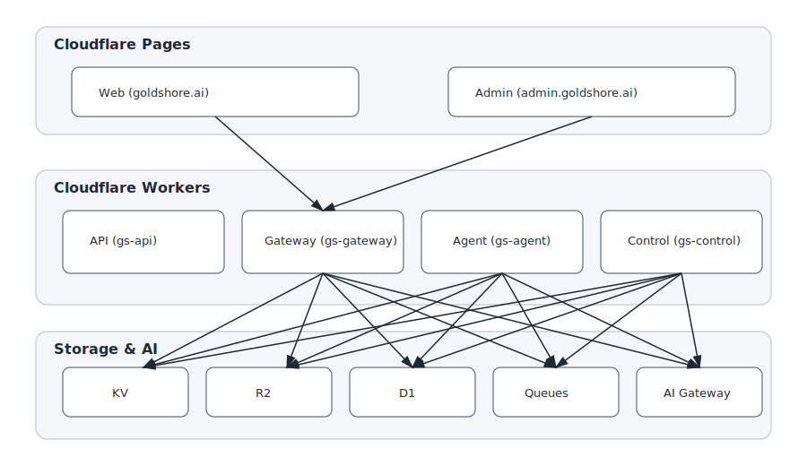

━━━━━━━━━━━━━━━━━━━━━━━━━━━━━━━━━━━━━━━━━━━

# 🟦 GoldShore Monorepo

> Looking for the updated documentation? See [README-v2.md](./README-v2.md).
> ━━━━━━━━━━━━━━━━━━━━━━━━━━━━━━━━━━━━━━━━━━━

Unified platform for the **GoldShore** ecosystem, built with:

- **Astro** (Web + Admin SSR)
- **Cloudflare Pages** (Frontend hosting)
- **Cloudflare Workers** (API + Gateway + Control + Agent)
- **KV, R2, D1, Queues, AI Gateway**
- **pnpm + Turborepo** (Monorepo orchestration)

This repository contains _all_ applications, shared packages, and infrastructure code used in production.
The GoldShore Monorepo powers the entire GoldShore ecosystem, including:
• Public Website (Astro + Cloudflare Pages)
• Admin Cockpit Dashboard (Astro SSR + GoldShore UI Kit)
• API Layer (Hono + Cloudflare Workers)
• Gateway Layer (routing, throttling, AI gateway)
• Agent Layer (Autonomous AI service)
• Control Worker (DNS automation, binding sync, deployments)
• Shared Design System (UI components, tokens, themes)
• Infrastructure (Cloudflare + GitHub Actions)

The monorepo uses:
• pnpm for workspace management
• Turborepo for task orchestration
• TypeScript everywhere
• Astro for frontend
• Cloudflare Workers for backend
• A unified theme + UI kit across apps

---

## 📚 Where to find X

- **Architecture & current monorepo state:** [`CURRENT_MONOREPO_STATE.md`](./CURRENT_MONOREPO_STATE.md)
- **Branch operations (mergeability, drift checks, workflows):** [`docs/ops/mergeable-branches.md`](./docs/ops/mergeable-branches.md)
- **Deprecated packages / dependency debt tracking:** [`DEPRECATED_PACKAGES.md`](./DEPRECATED_PACKAGES.md)
- **Developer website rollout guide:** [`docs/developer-briefing.md`](./docs/developer-briefing.md)
- **Copy and tone guide:** [`docs/copy-style-guide.md`](./docs/copy-style-guide.md)

---

## Website rollout docs

- Developer briefing: `docs/developer-briefing.md`
- Copy style guide: `docs/copy-style-guide.md`
- Site config and feature flags: `src/data/site-config.json`

# 🚀 Vibe Coding & Ecosystem

We adhere to the **Vibe Coding** philosophy: Human-in-the-Loop (HITL) engineering where AI agents (Jules, Sentinel, GoldShore Agent) handle routine operations, security scanning, and hygiene, allowing humans to focus on high-value architecture.

### Integrated Tech Stack

- **AI Models:** Google Gemini, OpenAI GPT-4, Anthropic Claude (via Cloudflare AI Gateway).
- **Financial Data:** Alpaca, Thinkorswim (Planned Integrations).
- **Automation:** Jules-Bot (GitHub Hygiene), Sentinel (Security), GoldShore Agent (Background Tasks).

See [ECOSYSTEM.md](./ECOSYSTEM.md) for full details on our extensions and AI integrations.

---

# 🚀 Architecture Overview



Diagram source: [`docs/architecture/diagram.mmd`](docs/architecture/diagram.mmd).

---

# 📁 Repository Structure

```
/
├── apps/
│   ├── gs-web/            # Public website (Astro)
│   ├── gs-admin/          # Admin dashboard (Astro)
│   ├── gs-api/            # Hono API (Workers)
│   ├── gs-gateway/        # Router + jobs (Workers)
│   ├── gs-agent/          # AI Agent Service (Workers)
│   ├── gs-control/        # Infra automation
│   └── jules-bot/         # GitHub Automation Bot
│
├── packages/
│   ├── ui/                # Shared component library
│   ├── theme/             # Design tokens + CSS
│   ├── utils/             # Shared helpers
│   ├── auth/              # Cloudflare Access JWT utils
│   └── config/            # TS/ESLint/Prettier configs
│
└── infra/
    ├── cloudflare/        # wrangler.toml templates
    └── github/            # GitHub Actions CI/CD
```

---

# 🧩 Applications

## **1. apps/gs-web – Public Website (Astro)**

- Marketing site
- User portal
- OAuth/Access session integration
- Light/dark theme from `packages/theme`

### Public Routes

```
/
├── about
├── pricing
├── legal/privacy
├── legal/terms
└── contact
```

### Authenticated User Portal

```
/app
├── dashboard
├── profile
├── logs
└── settings
```

---

## **2. apps/gs-admin – Admin Dashboard (Astro)**

Protected by **Cloudflare Access**.

### Admin Sections

```
/admin
├── overview
├── api-logs
├── workers
│   ├── status
│   ├── bindings
│   └── routes
├── users
│   ├── list
│   ├── sessions
│   └── permissions
└── system
    ├── dns
    ├── pages
    ├── storage
    └── secrets
```

---

## **3. apps/gs-api – gs-api**

Hono-based API Worker.

```
Route: https://api.goldshore.ai/*
```

### Endpoints

```
GET   /health
GET   /version
POST  /auth/login
GET   /auth/session
GET   /content/:slug
POST  /queue/task
```

Bindings:

```
KV = gs-kv
R2 = gs-assets
D1 = gs-db
AI = AI (AI Gateway)
```

---

## **4. apps/gateway – gs-gateway**

Request router + queue dispatcher.

```
Route: https://gw.goldshore.ai/*
```

Responsibilities:

- Reverse proxy → gs-api
- Queue ingestion
- Rate limiting
- JWT / Access token verification
- Preflight filtering (IP / SNI policies)

---

## **5. apps/gs-agent – gs-agent**

Autonomous AI Agent Service.

Responsibilities:

- Background reasoning tasks
- Integration with external AI models
- Complex workflow orchestration

---

## **6. gs-control (optional)**

System worker for automation:

- DNS updates
- Preview environment creation
- Worker deployment orchestrator
- Secret rotation
- Observability sync

```
Route: https://ops.goldshore.ai/*
```

---

# 🎨 Shared Packages

## **packages/theme**

Design tokens:

- tokens.css
- Colors / radii / spacing
- Astro CSS variables
- Used by both web + admin

## **packages/ui**

Component library:

- Typography
- Buttons, Inputs
- Cards, Tables
- Navbars, Sidebars
- Tailwind/Vanilla CSS compatible

---

# 🧩 Template Pages & Modules

Template pages are kept alongside each app so navigation, menus, containers, and search remain pluggable.

| App        | Template Location                            | Notes                           |
| ---------- | -------------------------------------------- | ------------------------------- |
| Web        | `apps/gs-web/src/pages/templates/index.astro`   | Marketing + search composition  |
| Admin      | `apps/gs-admin/src/pages/templates/index.astro` | Dashboard shell + table samples |
| API Worker | `apps/gs-api/src/routes/templates.ts`    | Module checklist for API growth |
| Gateway    | `apps/gs-gateway/src/index.ts` (`/templates`)   | Routing + AI dispatch template  |
| Agent      | `apps/gs-agent/src/index.ts` (`/templates`)  | HITL orchestration template     |

---

# 🔗 Integration Matrix (Current + Planned)

GoldShore templates are designed to integrate with:

- **AI Providers**: Google Gemini, OpenAI ChatGPT, Anthropic Claude (via AI Gateway).
- **Operational Assistants**: Jules, GitHub Copilot, and custom HITL review workflows.
- **Cloudflare**: Workers, Pages, Queues, D1, R2, and AI Gateway.
- **DevOps**: GitHub Actions, GitHub Issues/Projects, and deploy previews.
- **Market Data + Trading**: Alpaca, Thinkorswim, Polygon, Tradier, and FIX gateways.
- **Ecommerce + CRM**: Stripe, Shopify, HubSpot, Salesforce, and outbound messaging.

Use these integrations to expand website management, SEO automation, admin analytics,
AI agent tooling, and market data services without rebuilding existing modules.

---

# 🧭 Continuity Tracking

To keep issues, workflows, PRs, branches, and components aligned:

- Track work in **GitHub Issues/Projects** and the templates in `.github/ISSUE_TEMPLATE/`.
- Review deployment flow in `infra/github/workflows/`.
- Use `ops/pr-playbook.md` and `ops/maintenance-playbook.md` for release continuity.
- Follow `docs/ops/branch-governance.md` and verify remote branch existence (`git ls-remote --heads origin <branch>`) before any automated `git checkout` or rebase step.
- Document component ownership in the admin dashboard templates and UI kit README.

## **packages/utils**

TypeScript utilities:

- fetch wrapper
- env loader
- request helpers
- error handling

## **packages/auth**

Cloudflare Access helpers:

- JWKS retrieval
- Audience validation
- getUser(request)

## **packages/config**

Monorepo-wide:

- eslint
- prettier
- tsconfig base

---

# 🌐 Domains & DNS

| Component      | Domain                     | Hosting        |
| -------------- | -------------------------- | -------------- |
| Web            | https://goldshore.ai       | Pages          |
| Admin          | https://admin.goldshore.ai | Pages + Access |
| API Worker     | https://api.goldshore.ai   | Workers        |
| Gateway Worker | https://gw.goldshore.ai    | Workers        |
| Control Worker | https://ops.goldshore.ai   | Workers        |

---

# 🛰 API + Gateway Routing

```
Client → Gateway → API → Storage
```

Example flow:

```
GET https://gw.goldshore.ai/content/slug
   → routes internally to gs-api
   → fetches content
   → returns JSON
```

Control worker routes:

```
POST /system/sync
POST /dns/update
POST /preview/create
```

---

# 🔧 Cloudflare Bindings

All workers use:

```
KV:         gs-kv
R2:         gs-assets
D1:         gs-db
AI:         AI Gateway
Services:   API -> gs-api
            GATEWAY -> gs-gateway
Queues:     jobsQueue (optional)
```

---

# 🔄 CI/CD Workflows (GitHub Actions)

Location:

```
infra/github/workflows/
```

Workflows included:

```
preview-web.yml
preview-admin.yml
deploy-api.yml
deploy-gateway.yml
deploy-control.yml
```

Features:

- pnpm install
- Pinned SHA for all actions
- Preview deploys for PRs
- Automatic production deploy on main
- Cloudflare Pages + Workers deploy

---

# 💻 Local Development

Install dependencies:

```bash
pnpm install
```

Run everything:

```bash
pnpm dev
```

Run individual app:

```bash
pnpm --filter @goldshore/gs-web dev
pnpm --filter @goldshore/gs-admin dev
pnpm --filter @goldshore/gs-api-worker dev
```

Build all:

```bash
pnpm build
```

---

# 🚀 Deployment Guide

Pages deploy automatically via GitHub Actions.

Workers deploy:

```bash
pnpm --filter @goldshore/gs-api-worker deploy
pnpm --filter @goldshore/gateway deploy
pnpm --filter @goldshore/control deploy
```

---

# 📌 Versioning Strategy

- `main` → Production
- `feature/*` → Preview Deployments
- `release/*` → Staging

---

# 🔐 License

Proprietary © GoldShore Labs
All rights reserved.

━━━━━━━━━━━━━━━━━━━━━━━━━━━━━━━━━━━━━━━━━━━
GoldShore Brand Variants

<table>
<tr>
<td></td>
<td></td>
</tr>
<tr>
<td></td>
<td></td>
</tr>
<tr>
<td></td>
<td></td>
</tr>
</table>

---

🧭 Monorepo Structure

goldshore-ai/
│
├── apps/
│ ├── web/ → Public website (Astro + CF Pages)
│ ├── admin/ → Admin Cockpit (Astro SSR)
│ ├── api-worker/ → Hono API Worker
│ ├── gateway/ → Edge gateway router
│ └── control-worker/ → Infra automation (DNS, bindings)
│
├── packages/
│ ├── ui/ → GoldShore UI component library
│ ├── theme/ → Tokens, CSS vars, theming engine
│ ├── config/ → Shared TS, ESLint, Prettier configs
│ └── utils/ → Shared helpers
│
└── infra/
├── cloudflare/ → wrangler.toml, DNS maps, bindings
└── github/ → Workflows for CI/CD

---

🔥 Apps Overview

🌐 apps/gs-web — GoldShore Public Website
• Astro SSR
• Powered by the GoldShore UI Kit
• Deploys via Cloudflare Pages
• Theming powered by packages/theme
• Pulls dynamic content from API + Gateway

Hero Example

---

🛠 apps/gs-admin — GoldShore Admin Cockpit

This is your hyper-modern operational dashboard.

<table>
<tr>
<td></td>
<td></td>
</tr>
</table>

Features
• Realtime visitors
• Task manager
• Ad engine metrics
• Trading analytics
• Widgets API
• Inter-app control center
• API/Gateway integration

---

🧩 packages/ui — GoldShore UI Component Kit
• 100% framework-agnostic components
• Works in Astro, Workers, Hono frontends
• Shared design system
• Includes:

<Button>
<Card>
<StatsBox>
<CockpitGauge>
<WidgetPane>
<MetricCard>
<GlowPanel>
<ThemeToggle>

---

🎨 packages/theme — Tokens & Dynamic Themes

Every app uses the same token set:

tokens.css
└── Colors
└── Radii
└── Typography
└── Effects (glow, blur, depth)
└── Shadows
└── Spacing
└── Grid

Supports:
• Light mode
• Dark mode
• Neon mode
• Penrose mode (GoldShore default)
• System override

---

⚙️ apps/gs-api — Main API (Hono)
• Edge-native API
• Zod schemas
• Hono router
• Cookie/session utilities
• Cloudflare bindings
• Responds to the admin + web apps
• Preconfigured OpenAPI generation

---

🚏 apps/gateway — Routing & AI Gateway

Handles:
• URL-based routing
• Load balancing
• Service binding switching
• AI Gateway proxy
• Authorization pre-checks

---

🛰 apps/control-worker — Infra Automation

Can automatically:
• Create DNS records
• Attach KV / R2 / D1 bindings
• Create preview domains
• Sync environment variables
• Repair worker routes
• Enforce idempotent deployment rules

This replaces Terraform (optional).

---

🚀 Development Workflow

Install dependencies:

pnpm install

Run everything:

pnpm dev

Run only the admin app:

pnpm --filter ./apps/gs-admin dev

Run the web app:

pnpm --filter ./apps/gs-web dev

Run API worker:

pnpm --filter ./apps/gs-api dev

Build all:

pnpm build

---

🧪 Testing

Playwright tests live in:

apps/gs-admin/tests
apps/gs-web/tests

Run:

pnpm test

---

🌩 Deployment (Cloudflare)

Deploy is handled by GitHub Actions:

infra/github/workflows/deploy.yml

CI/CD steps: 1. Install dependencies 2. Build workspaces with Turbo 3. Deploy:
• web → Cloudflare Pages
• admin → Cloudflare Pages
• gs-api → Workers
• gateway → Workers
• control-worker → Workers

Preview branches automatically deploy to:

{branch}.goldshore-pages.dev
api-preview.goldshore.ai
gw-preview.goldshore.ai
admin-preview.goldshore.ai

---

🏁 Closing Preview

---

✅ README is Ready

If you want:

✔ A version with a table of contents
✔ A version with architecture diagrams
✔ A version with installation badges + shields.io
✔ A split README per app
✔ Auto-generated Markdown with relative paths for GitHub

Just tell me:

“Generate README v2”,
or
“Generate per-app READMEs”,
or
“Generate architecture diagram”.

I can produce all variants.
